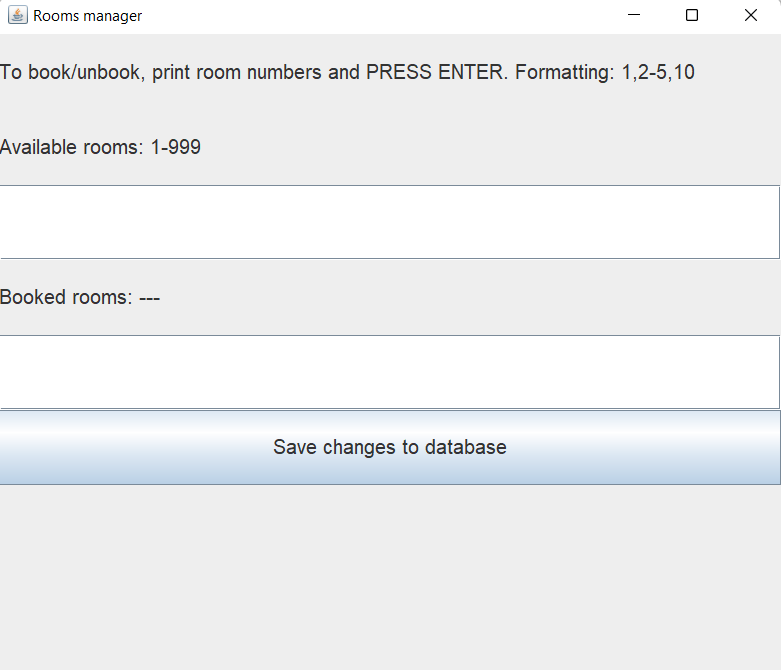

## General
Jar and classes are already in the repository. Run the app from the root, specify the path to SQLite driver: 
- `java -classpath ".;dbconnect/sqlite.jar" app/App` - this should open a GUI window. Write rooms which you need to book/unbook in the described format (1-3,6,9-10), press Enter, then press "Save changes to the database". That's how it should look

Used packages:
- `jdk1.8.0_333` 
- `jre1.8.0_333`  
- `sqlite-jdbc/3.36.0.3` as the driver (https://mvnrepository.com/artifact/org.xerial/sqlite-jdbc/3.36.0.3) 

## Database
By default, **dbconnect/Hotel.db** contains a single table "Hotel" with 999 free rooms which the user is supposed to see in the dialogue window. 
The structure of the table is as follows, 
- `RoomNumber` (int) from 1 to 999
- `Booked` (int) which is initially 0 (not booked) and changes to 1 if the room is booked. 

When you open second time, the updated info should be shown. 

## Classes' structure
I've tried to make the app adoptive to future upgrades. Therefore I assumed that in principle room numbers may be not a continious sequence (for example, 1,2,4, where 3 is absent), and implemented a dialogue window which lists the available rooms. That required a bit longer code.
- `Room` is a class with two attributes, Number and Booked status.
- `DbConnect` has two public functions:
-- `List<Room> executeQueryRooms()` returns a list of all rooms which are in the database at the moment.
-- `void executeUpdateRooms(List<Room>)` puts the results of manipulation into the database.
- `App` creates a window for the user to work with. Along with the GUI part, it has parser function to transform the list of rooms into human-readable format and back:
-- `makeLabel` creates a string of booked(1) or free(0) rooms, for example 1-3,6,9-10
-- `parseInput` converts such string into a TreeSet of numbers which then is )used to update `List<Room>`. 
- `Compare` is comparator for room sorting by room number (in case if they are not ordered in the DB)

## Test
Run test from the root. Specify the path to JUnit: 
- `java -classpath ".;test/junit.jar" org.junit.runner.JUnitCore test.MyTest`
The test evaluates the parser functions from the App class. 

To recompile everything:
- `javac room/Room.java compare/Compare.java dbconnect/DbConnect.java app/App.java -classpath ".;test/junit.jar" test/MyTest.java`
